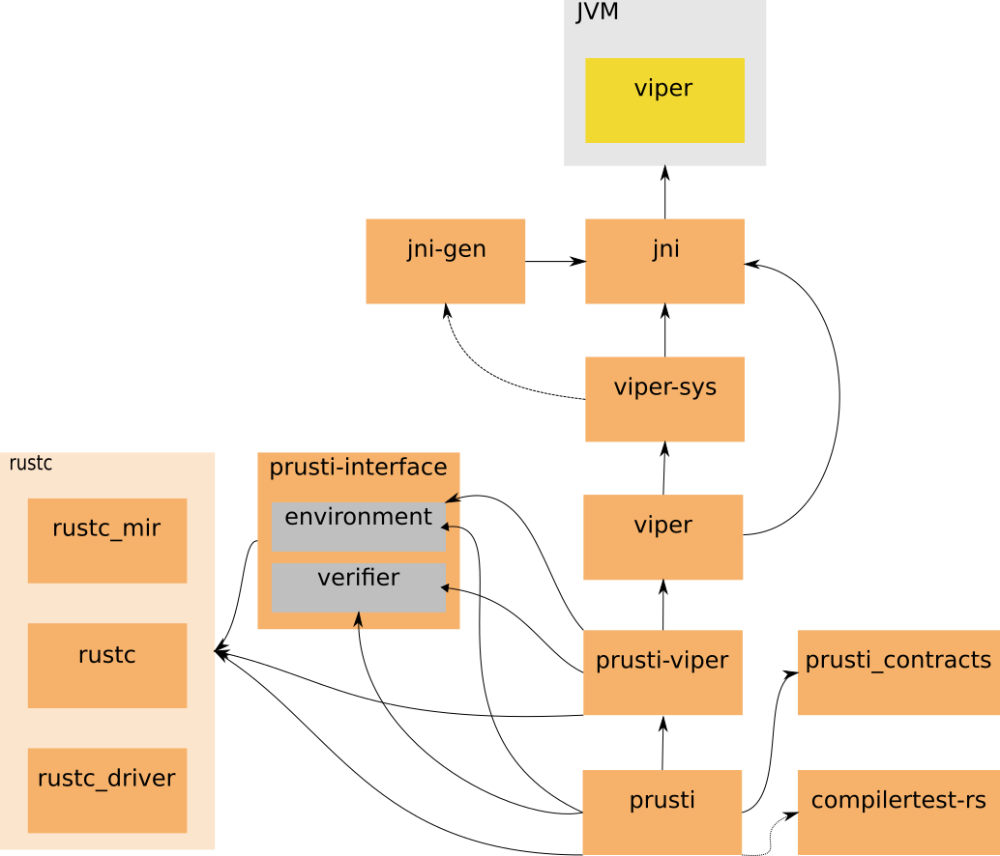

# Components

## jni

[Main page](https://crates.io/crates/jni)

A crate that provides Java native interface bindings for Rust.

## jni-gen

[Main page](https://github.com/viperproject/jni-gen)

A crate that provides generation of Rust wrapper methods for calling
Java classes.

This crate is only a build dependency needed to generate Viper bindings.

## viper-sys

[Main page](https://github.com/viperproject/viper-sys)

A low-level interface to Viper.

## viper

[Main page](https://github.com/viperproject/viper)

High-level interface to Viper.

## prusti

[Main page](https://github.com/viperproject/prusti)

The main crate that extracts information from the Rust compiler and
“drives” the verification.

## compilertest-rs

[Main page](https://github.com/laumann/compiletest-rs)

Crate for testing the Rust compiler and linters. Tests are Rust
source files with annotations similar to what we have in Viper.

This crate is only a development dependency of `prusti`.

## prusti_contracts

[Main page](https://github.com/viperproject/prusti_contracts)

A crate that provides ghost functions such as `old` used in the
specifications of programs being verified.

## prusti_viper

[Main page](https://github.com/viperproject/prusti_viper)

A crate that translates MIR into Viper, and reports errors back.

## rustc

The main Rust compiler crate.

## rustc_driver

The crate that provides the way to “drive” the compilation of program.

## rustc_mir

Implementation of the middle intermediate representation. This crate
also contains implementation of all algorithms that work on the MIR
level, for example, borrow checker.

## prusti-interface

[Main page](https://github.com/viperproject/prusti_interface)

A crate that provides interfaces for communication between
`prusti-viper` and `prusti`. This crate is needed to break the cyclic
dependency between `prusti-viper` and `prusti`. `prusti` drives the
whole verification process, so it needs to initialize `prusti-viper`,
give it instructions what to verify and get the results back.
On the other hand, `prusti-viper` needs to call back to `prusti` to
retrieve information about the program being verified.

This crate is described in more detail in [this
chapter](./04_prusti_interface.html).
